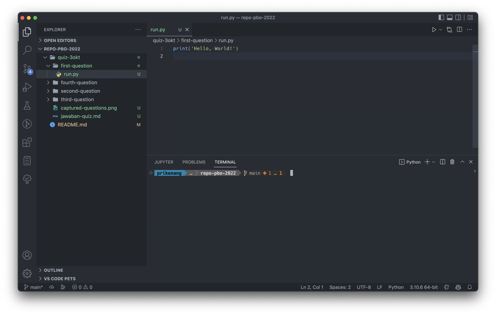
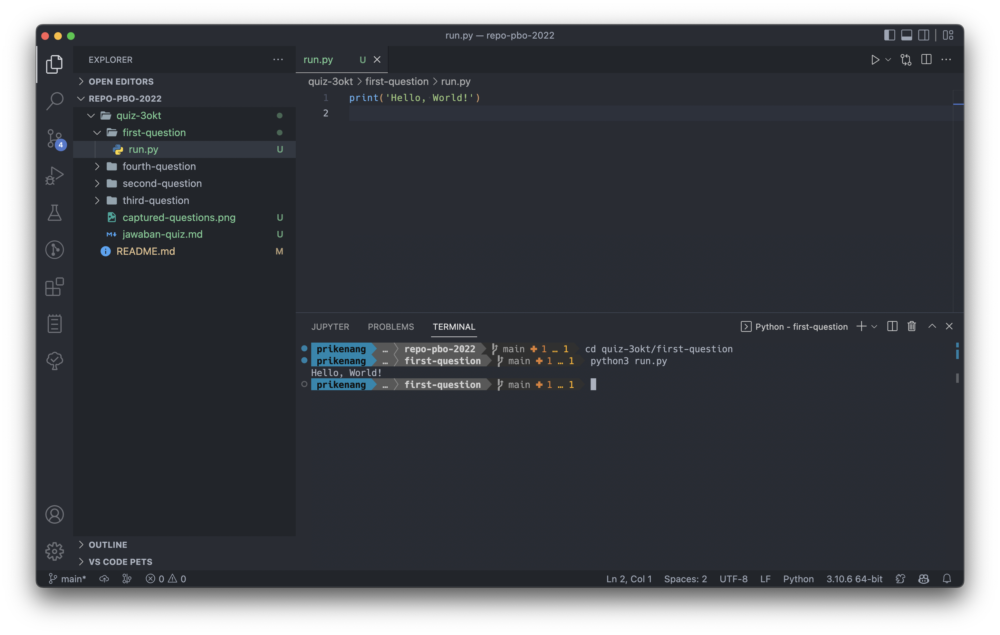

Quiz - 3 Oktober 2022

1. How to run python with your tools (full with capture)
   [answer](#1-how-to-run-python-with-your-tools)
2. Make a simple python program with output your name and nim (full with capture and
   push to github)
   [answer](#2-make-a-simple-python-program-with-output-your-name-and-nim)
3. Make an operator python programming like +, -, /, \* with generate input int from
   user (full with capture and source code push to github)
   [answer](#3-make-an-operator-python-programming-with-generate-input-int-from-user)
4. Make a matrix 2x2 with python programming (bonus with do some logic + or - matrix)
   don't forget to capture and source code push to github
   [answer](#4-make-a-matrix-2x2-with-python-programming)

---

Jawaban Quiz

## 1. How to run python with your tools

- Python yang saya gunakan adalah versi 3.10.6 dan di install ke dalam Mac OS
  menggunakan Homebrew.

- Setelah membuka folder repository dan membuat file .py, ubah direktori di terminal
  menuju direktori file yang akan dijalankan

   

- Program .py dijalankan dengan command `python3 [nama file]`. Contoh:
  `python3 run.py`

   

## 2. Make a simple python program with output your name and nim

## 3. Make an operator python programming with generate input int from user

## 4. Make a matrix 2x2 with python programming
